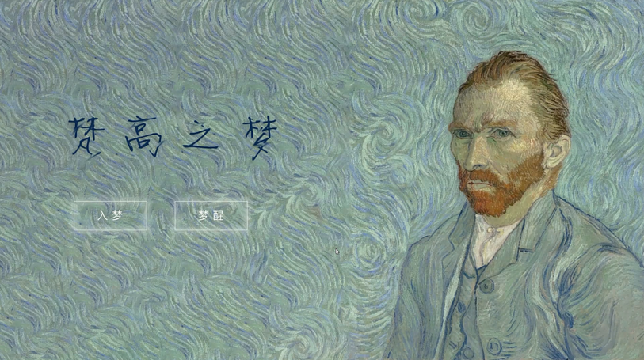
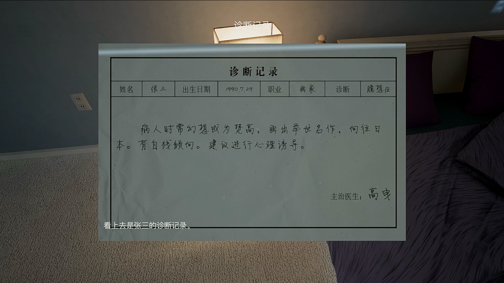
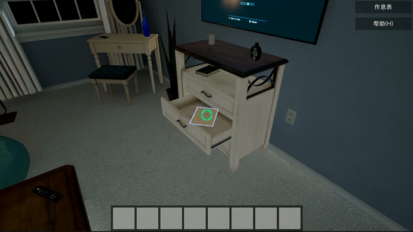
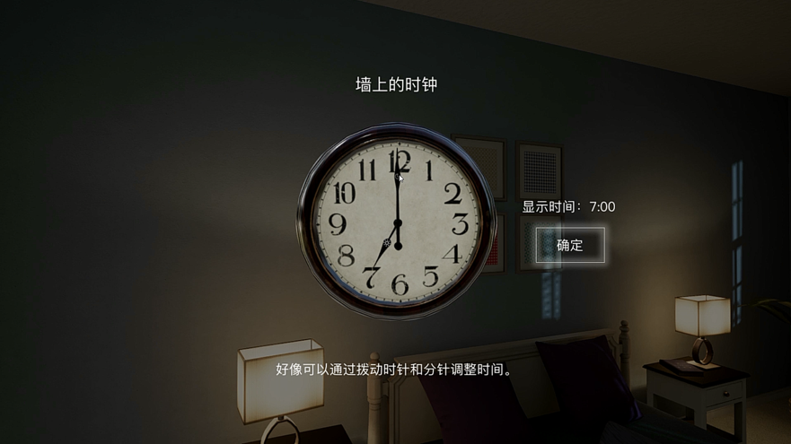

# Vincents' Dream 

Vincent's Dream is a **puzzle game** about dream and redemption. In this game, you are going to help Vincent Van Gogh to accomplish his dreams about travling to Japan.

This game is made using **Unreal Engine 4**, one of the most powerful game engine ever on earch. You can know more about the stories behind Vincent's magnificent painting and solve mistery along the way.

Check out our [wiki](vitalight/Vincent-s-Dream/wiki) for detail.

## Screenshots

- Stories to be told

- Lost to be found

- Mistery to be solved

